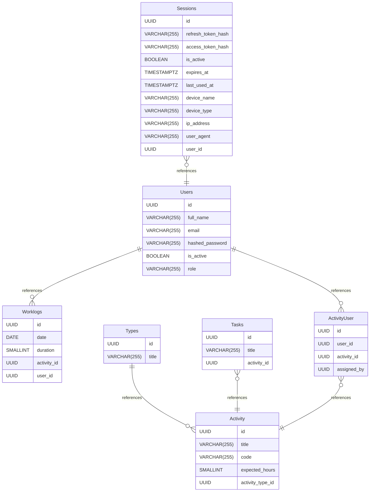

# Untitled Diagram documentation
## Summary

- [Introduction](#introduction)
- [Database Type](#database-type)
- [Table Structure](#table-structure)
	- [Sessions](#sessions)
	- [Activity Types](#activity types)
	- [Activity](#activity)
	- [Activity Tasks](#activity tasks)
	- [ActivityUser](#activityuser)
	- [Worklogs](#worklogs)
	- [Users](#users)
- [Relationships](#relationships)
- [Database Diagram](#database-diagram)

## Introduction

## Database type

- **Database system:** PostgreSQL
## Table structure

### Sessions
A sessions table will be managing all user sessions.
| Name        | Type          | Settings                      | References                    | Note                           |
|-------------|---------------|-------------------------------|-------------------------------|--------------------------------|
| **id** | UUID | 🔑 PK, not null, unique |  | |
| **refresh_token_hash** | VARCHAR(255) | null |  | |
| **access_token_hash** | VARCHAR(255) | null |  | |
| **is_active** | BOOLEAN | null |  | |
| **expires_at** | TIMESTAMPTZ | null |  | |
| **last_used_at** | TIMESTAMPTZ | null |  | |
| **device_name** | VARCHAR(255) | null |  | |
| **device_type** | VARCHAR(255) | null |  | |
| **ip_address** | VARCHAR(255) | null |  | |
| **user_agent** | VARCHAR(255) | null |  | |
| **user_id** | UUID | null | fk_Sessions_user_id_Users | | 

#### Indexes
| Name | Unique | Fields |
|------|--------|--------|
| Sessions_index_0 |  | refresh_token_hash, access_token_hash |
### Activity Types

| Name        | Type          | Settings                      | References                    | Note                           |
|-------------|---------------|-------------------------------|-------------------------------|--------------------------------|
| **id** | UUID | 🔑 PK, not null, unique | fk_Activity Types_id_Activity | |
| **title** | VARCHAR(255) | null, unique |  | | 

### Activity

| Name        | Type          | Settings                      | References                    | Note                           |
|-------------|---------------|-------------------------------|-------------------------------|--------------------------------|
| **id** | UUID | 🔑 PK, not null, unique |  | |
| **title** | VARCHAR(255) | null |  | |
| **code** | VARCHAR(255) | null, unique |  | |
| **expected_hours** | SMALLINT | null |  | |
| **activity_type_id** | UUID | null |  | | 

### Activity Tasks

| Name        | Type          | Settings                      | References                    | Note                           |
|-------------|---------------|-------------------------------|-------------------------------|--------------------------------|
| **id** | UUID | 🔑 PK, not null, unique |  | |
| **title** | VARCHAR(255) | null, unique |  | |
| **activity_id** | UUID | null | fk_Activity Tasks_activity_id_Activity | | 

### ActivityUser
A many-to-many table linking users and activities. The general idea is that many employees could be working on the same activity (E.g. project)
| Name        | Type          | Settings                      | References                    | Note                           |
|-------------|---------------|-------------------------------|-------------------------------|--------------------------------|
| **id** | UUID | 🔑 PK, not null, unique |  | |
| **user_id** | UUID | null |  | |
| **activity_id** | UUID | null | fk_ActivityUser_activity_id_Activity | |
| **assigned_by** | UUID | null |  | | 

### Worklogs

| Name        | Type          | Settings                      | References                    | Note                           |
|-------------|---------------|-------------------------------|-------------------------------|--------------------------------|
| **id** | UUID | 🔑 PK, not null, unique |  | |
| **date** | DATE | null |  | |
| **duration** | SMALLINT | null |  | |
| **activity_id** | UUID | null |  | |
| **user_id** | UUID | null |  | | 

### Users
A table for managing all users in the system
| Name        | Type          | Settings                      | References                    | Note                           |
|-------------|---------------|-------------------------------|-------------------------------|--------------------------------|
| **id** | UUID | 🔑 PK, not null, unique | fk_Users_id_Worklogs,fk_Users_id_ActivityUser | |
| **full_name** | VARCHAR(255) | null |  | |
| **email** | VARCHAR(255) | null, unique |  | |
| **hashed_password** | VARCHAR(255) | null |  | |
| **is_active** | BOOLEAN | null |  | |
| **role** | VARCHAR(255) | null |  | | 

## Relationships

- **Users to Worklogs**: one_to_many
- **Users to ActivityUser**: one_to_many
- **Sessions to Users**: many_to_one
- **Activity Types to Activity**: one_to_many
- **Activity Tasks to Activity**: many_to_one
- **ActivityUser to Activity**: many_to_one

## Database Diagram

